# dsh-proof

**Evidence-Driven Completion Proof & Regression Attribution** — an open standard, a Proof MCP Server, host adapters and a DeepSeek Harness plugin.


> Turn **"I'm done"** from a self-report into a recomputable evidence chain.
> Turn **"I fixed it but broke something else"** from a post-mortem into in-flight attribution.

```
$ proof_claim "fixed the login redirect bug and added a regression test"
✓ PROVEN — fixed the login redirect bug and added a regression test
evidence root: 9f2c1ab47d0e
PROVEN (p≈0.97) — the claim is backed by evidence root 9f2c1ab47d0e:
3 check(s) passing, 0 regression(s), 1 pre-existing failure(s) left untouched.
```

📖 **[中文文档](./README.zh.md)** · 📜 **[Agent Proof Protocol](./PROTOCOL.md)** · 🔍 **[Audit findings ledger](./FINDINGS-LEDGER.md)**

---

## The gap

Agent harnesses tell you what they *did*; they do not tell you whether it *works*. Self-reports are written by the party with the most to gain from being believed — so "I'm done" is a claim, not a fact.

`dsh-proof` makes completion a **recomputable fact**:

- every objective check run is recorded as **evidence** — content-addressed, append-only, hash-chained;
- the chain is sealed by **signed checkpoints** the agent itself can never produce, and mirrored to an **out-of-band anchor** it can never reach;
- every mutation is **attributed** to the change that caused it, in-flight, not after the fact;
- a verification **verdict** — `proven` / `regressed` / `stale` / `unproven` / `no-baseline` — is derived by re-running the evidence, never by asking the agent.

---

## How it works — at a glance

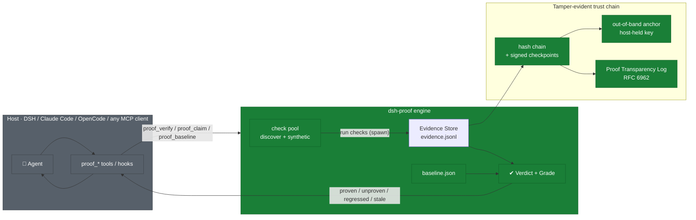

The host signals intent through `proof_*` tools; the engine runs objective checks, records what actually happened on a tamper-evident chain, and returns a grade a third party can re-derive from the bytes alone.

---

## One thesis, four shells

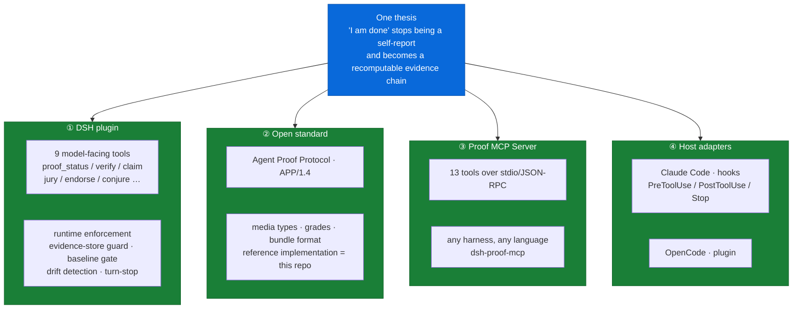

| Shell | What it is | Where |
|---|---|---|
| **DSH plugin** | nine model-facing tools + runtime enforcement | `src/index.ts`, `src/dsh/*` |
| **Open standard** | Agent Proof Protocol **APP/1.4** — vocabulary, addressing, chain, bundle format | `PROTOCOL.md`, `src/app/protocol.ts` |
| **Proof MCP Server** | thirteen tools over stdio; any harness, zero DSH install | `src/app/mcp-server.ts`, bin `dsh-proof-mcp` |
| **Host adapters** | Claude Code hooks & OpenCode plugin — enforce at the tool-call seam | `src/adapters/*` |

---

## Architecture — pure core, thin shells

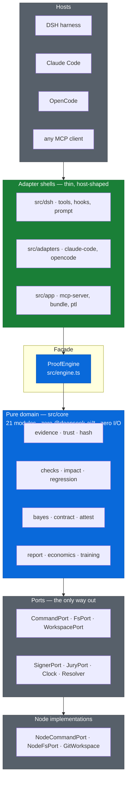

The pure domain (`src/core`) never imports `@deepseek-ai/*`, never opens a socket, never reads `process`. Everything it needs arrives through ports — so the same core runs under DSH, under any MCP client, and in a plain test suite with in-memory fakes.

---

## Core concepts

| Concept | Meaning | Code |
|---|---|---|
| **Claim** | a *typed* statement of completion, not free text — its kind binds it to evidence obligations | `src/core/contract.ts` |
| **Evidence** | one observed run of one check: command, status, output digest, workspace snapshot | `src/core/evidence.ts` |
| **Verdict** | the baseline→current differential for one check — credit, blame, or the honest middle | `verdictOf`, `src/core/evidence.ts` |
| **Grade** | what a whole run concluded: `proven` / `regressed` / `stale` / `unproven` / `no-baseline` | `decideGrade`, `src/core/report.ts` |
| **Baseline** | a named view over the log: latest record per check when work started, plus a Merkle root | `buildBaseline` |
| **Checkpoint** | a signed statement committing to "chain head H, after N records" — unforgeable by the agent | `EvidenceStore.checkpoint()` |
| **Anchor** | the highest checkpoint, mirrored outside the workspace next to the signing key — makes truncation detectable | `parseAnchor`, `src/core/trust.ts` |

---

## Evidence is self-addressing

Every record is addressed by the SHA-256 of its **canonical** form — so the same outcome yields the same address on any machine, and any reader can re-hash a record and check that it addresses itself.

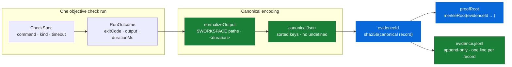

Keys are sorted, `undefined` is dropped, `-0` and `0` agree, non-finite numbers fold to `null`, and non-plain objects are **refused loudly** — an address that conflates two different values is strictly worse than a crash. Captured output is normalised before hashing (paths → `$WORKSPACE`, durations → `<duration>`, CRLF → LF), so the same failure on a different checkout is the *same evidence*.

---

## Trust model — the adversary is the auditee

The agent can read *and write* every byte in the workspace, including the evidence log — and it knows the protocol's own hashing functions well enough to rewrite a self-consistent history. Three lines of defense close that hole.

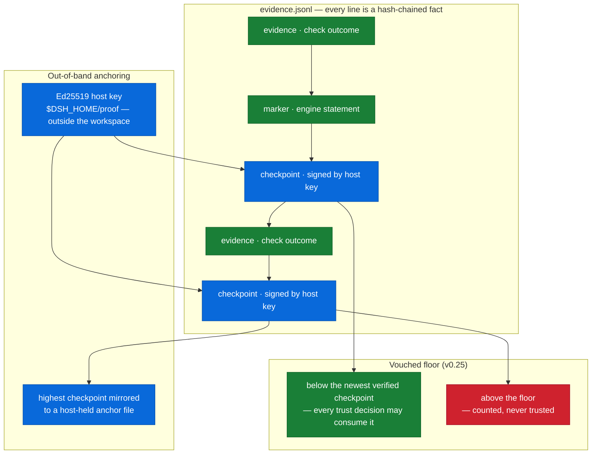

1. **Hash chain** — every line links to the previous via `prev = sha256(prevLine)`: editing, inserting or deleting any interior line breaks the link into the next.
2. **Signed checkpoints** — an Ed25519 signature over `{count, head, workspaceKey, at}` covers the chain head at a known record count. A forge can re-derive every digest but cannot forge the signature; the walker refuses checkpoints whose count or head disagrees with what it actually walked.
3. **Out-of-band anchor** — a log ending below the anchor's high-water mark is a **rewind**; the anchor's own signature failure is a **forged anchor**.
4. **Vouched floor (v0.25)** — every trust decision consumes only content *below* the newest checkpoint the host key actually verified; fresh appends above it are counted, never trusted.

---

## Three evidence classes

Verification does not have to be all-machine. Testimony re-enters the proof system — *graded*, never equal.

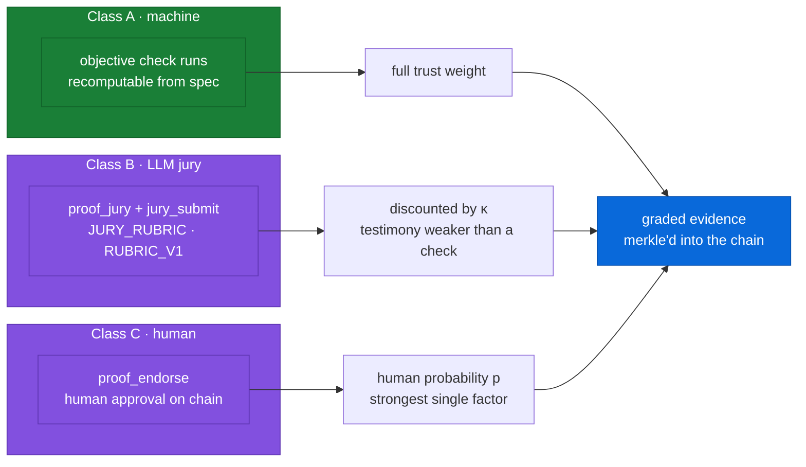

- **Class A (machine)** — objective check runs, recomputable from spec. Full weight, always.
- **Class B (LLM jury)** — `proof_jury` deliberations per the `JURY_RUBRIC`; discounted by a trust exponent κ because testimony is weaker than an executed check — and a weak factor can only *weaken* a verdict, never strengthen it.
- **Class C (human)** — `proof_endorse` puts a named human's approval on the chain; the strongest single factor, gated by a real host approval seam.

---

## Verification workflow — certify at 0.97, don't run everything

```mermaid
flowchart LR
    DISC["discover checks<br/>+ synthetic pool"] --> BASE["load baseline"] --> AUD["chain audit gate<br/>audit.ok? else cap stale"]
    AUD --> ATTR["attribute changeset<br/>which files moved?"]
    ATTR --> AFF["affected checks<br/>impact closure + LSP"]
    AFF --> RANK["rank by information gain / ms<br/>+ learn health priors"]
    RANK --> WAVE["run next wave<br/>concurrently"]

    WAVE --> POST["update posterior<br/>per check factor"]
    POST --> GATE{"P(claim) ≥ 0.97?"}
    GATE -->|"no · budget left"| WAVE
    GATE -->|"yes"| GRADE["grade: proven"]
    GATE -->|"budget exhausted"| GRADE2["grade: unproven / regressed"]

    classDef blue fill:#0969da,stroke:#0550ae,color:#fff
    classDef green fill:#1a7f37,stroke:#116329,color:#fff
    classDef red fill:#cf222e,stroke:#a40e26,color:#fff
    class AUD red
    class GATE blue
    class GRADE,GRADE2 green
```

`proof_verify` treats each check as a Bayesian factor: prior health from history, per-run costs, impact distance from the change set (graph closure + LSP-refined edges). Checks are ranked by **expected information gain per millisecond**, run in waves, and the posterior is updated from real outcomes — stopping the moment `P(claim) ≥ 0.97`. Missing evidence is never papered over: a chain that fails its own audit caps every grade at `stale`.

---

## Regression attribution — who broke what, in-flight

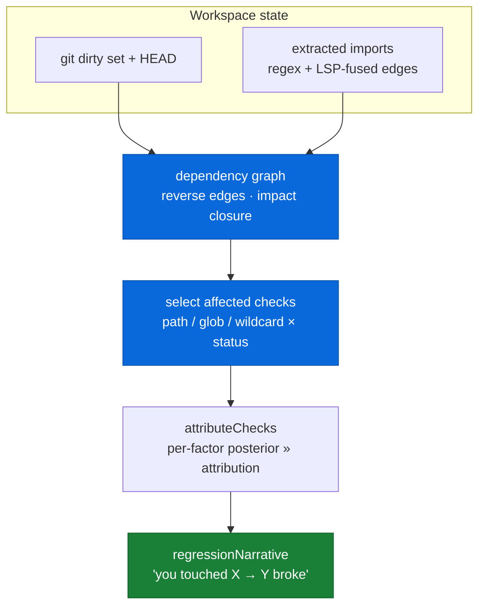

Regressions are judged against the **baseline view** — the latest record per check when work started. A `pass → fail` move is a `regression` charged to this session; a `fail → fail` move is `still-failing`, *never* charged to the session; `error` / `timeout` / `aborted` are non-decisive — neither credit nor blame. The attribution narrative names exactly which files' changes selected which checks.

---

## Claims as typed contracts

Free-text claims bind weaker than machines. `proof_claim` upgrades a claim into one of five **typed contracts**, each binding its own evidence obligations — `proven: true` only when every obligation holds, otherwise `blockers` is the to-do list.

```mermaid
flowchart LR
    CLAIM["natural-language claim<br/>'adding X keeps Y working'"] --> KINDS

    subgraph KINDS["five claim kinds — obligations auto-bound"]
        K1["behavior-keep"]
        K2["behavior-add"]
        K3["performance-budget"]
        K4["docs-only"]
        K5["jury"]
    end

    KINDS --> OBL["obligation set<br/>which checks · which evidence · which jury rubric"]
    OBL --> V["verify → contract verdict"]
    V --> COST["cost via injected RateCard<br/>per-assertion, per-confidence"]

    classDef blue fill:#0969da,stroke:#0550ae,color:#fff
    classDef green fill:#1a7f37,stroke:#116329,color:#fff
    class CLAIM,OBL blue
    class V green
```

| Kind | Obligations (beyond the shared zero-regressions floor) |
|---|---|
| `behavior-preserving` | the public export face must not move in either direction |
| `behavior-adding` | every changed source path is exercised by a passing check |
| `perf-budget` | a decisive benchmark measurement inside the stated budget |
| `docs-only` | change set really is documents; checks skipped, confidence capped |
| `llm-jury` | an active jury deliberation upholds the exact claim text |

---

## Conjured verification — for the unchecked

Not every claim has an objective test. `proof_conjure` lets the agent draft a synthetic test for the claim and execute it **on chain** — recorded, priced and discounted, never equal to an independent check.

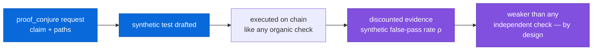

---

## Multi-agent accountability — the responsibility DAG

Delegation is only as strong as the weakest proof in the tree. Since v0.19, a delegated task mints a **proof obligation** on the chain; a parent's `proven` is preconditioned on its children's; every DAG edge is an independently re-verifiable proof bundle.

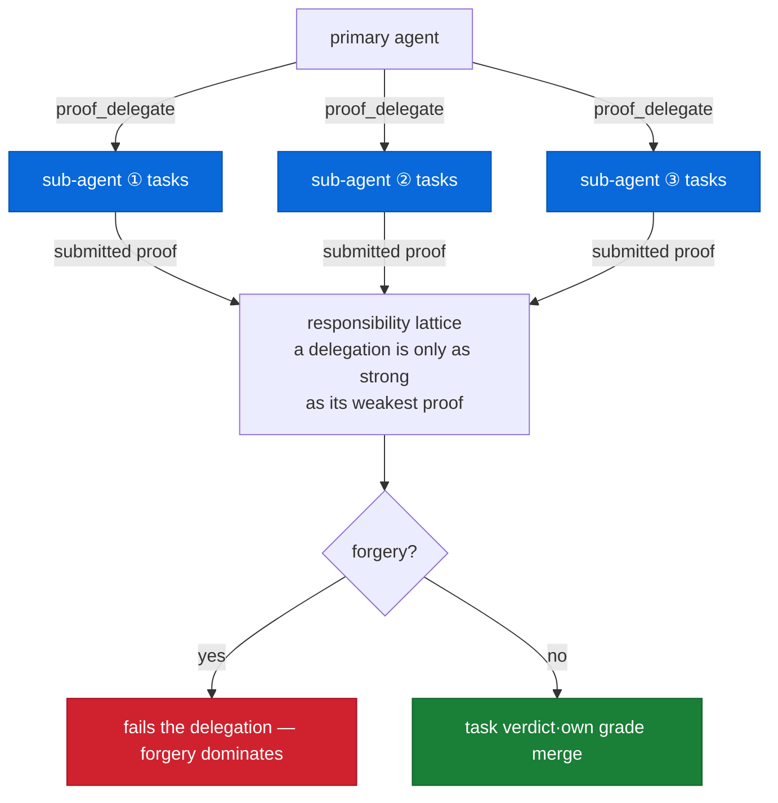

## Verification economics — the unit cost of trust

Since v0.21 every priced run leaves an **economics ledger** on the chain: compute spent, assertions verified, confidence purchased, information gained — each per dollar. Prices are **injected by the deployer** (`RateCard`), never embedded; swap the card and the same evidence reprices.

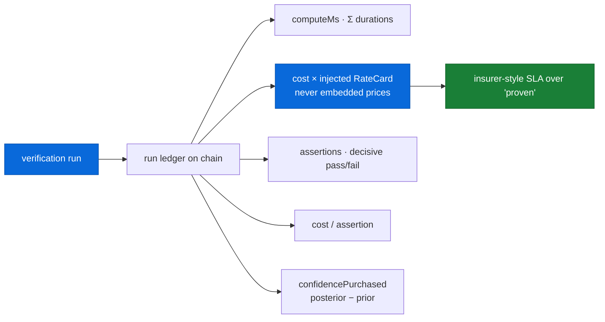

`confidencePurchased = posterior − prior` — the marginal confidence a run actually bought, `null` when either side was never measured (never zero). `proof_sla_quote` prices a `proven` grade into an insurance-style offer; `regressed` is honestly denied, and the quote is content-addressed onto the chain so it can never be silently rewritten.

---

## Tool surface

**MCP server — thirteen conformance tools** (APP/1.4), plus the DSH plugin's nine. All results are canonical JSON.

| Tool | What it does |
|---|---|
| `proof_status` | baseline presence, discovered checks, chain mode & integrity |
| `proof_baseline` | run everything, record evidence, save the baseline view |
| `proof_verify` | graded verdict + per-check verdicts + regression attribution |
| `proof_claim` | typed contract check: obligations all hold → `proven` |
| `proof_bundle` | assemble manifest + log + anchor into a portable bundle |
| `proof_publish` | append the latest signed checkpoint to the transparency log |
| `proof_log_verify` | audit the transparency log from its own bytes |
| `proof_delegate` | mint a child's proof obligation + worker instruction |
| `proof_delegate_submit` | adjudicate a submitted bundle; anchor caps the grade |
| `proof_task` | whole-graph overview or one task's composed verdict |
| `proof_training_export` | distill the chain into a labeled, chain-anchored dataset |
| `proof_economics` | replay the most recent run ledger on chain |
| `proof_sla_quote` | price a `proven` grade into an insurance-style SLA |

Jury, endorsement and conjure live on the **DSH plugin face only** — they depend on host-held seams (an approval prompt, a session) an open server cannot assume: `proof_jury`, `proof_jury_submit`, `proof_endorse`, `proof_conjure`, `proof_conjure_run`.

---

## Quickstart

### 1 · Proof MCP Server — any harness, no DSH install

```sh
npm i -g dsh-proof        # or: npx dsh-proof-mcp
DSH_PROOF_ROOT=/path/to/project dsh-proof-mcp
# or straight from a checkout:
node --experimental-strip-types src/app/mcp-entry.ts
```

Point any MCP client at it — Claude Desktop, Cursor, anything that speaks MCP:

```json
{
  "mcpServers": {
    "dsh-proof": {
      "command": "dsh-proof-mcp",
      "env": {
        "DSH_PROOF_ROOT": "/path/to/your/project",
        "DSH_PROOF_TRUST_DIR": "/path/to/trust/root",
        "DSH_PROOF_EVIDENCE_STORE": "host"
      }
    }
  }
}
```

First run: `proof_baseline` (every discovered check runs once; the signed chain + anchor are established) → `proof_verify` (graded verdict) → `proof_claim` (prove a claim) → `proof_bundle` (pack for hand-off).

### 2 · DSH plugin

```sh
dsh plugin --profile web add dsh-proof        # from a registry
dsh plugin --profile web add ./dsh-proof      # from a local checkout
```

### 3 · Claude Code — hooks enforce what no server can

Register the tool face, then paste the hooks into `.claude/settings.json`:

```sh
claude mcp add proof -- dsh-proof-mcp
```

```json
{
  "hooks": {
    "PreToolUse":  [{ "matcher": ["Write", "Edit", "MultiEdit", "NotebookEdit", "Bash"],
                      "hooks": [{ "type": "command", "command": "dsh-proof-cc pre-tool-use" }] }],
    "PostToolUse": [{ "matcher": ["Write", "Edit", "MultiEdit", "NotebookEdit", "Bash", "Read"],
                      "hooks": [{ "type": "command", "command": "dsh-proof-cc post-tool-use" }] }],
    "Stop":        [{ "hooks": [{ "type": "command", "command": "dsh-proof-cc stop" }] }],
    "SessionStart":[{ "hooks": [{ "type": "command", "command": "dsh-proof-cc session-start" }] }]
  }
}
```

### 4 · OpenCode

Merge into your `opencode.json` (build first from a checkout: `npm run build`):

```json
{
  "plugin": ["dsh-proof/lib/adapters/opencode/plugin.js"],
  "mcp": {
    "proof": {
      "type": "local",
      "command": ["dsh-proof-mcp"],
      "environment": { "DSH_PROOF_EVIDENCE_STORE": "host" }
    }
  }
}
```

Full commented examples: [claude-code.settings.json](./examples/claude-code.settings.json), [opencode.json](./examples/opencode.json).

---

## Configuration

Everything tunable is a configuration field — nothing is hardcoded. The MCP server, both adapters and `dsh-proof-ptl` are configured by environment variables:

| Env var | Meaning | Default |
|---|---|---|
| `DSH_PROOF_ROOT` | workspace root to verify | process cwd |
| `DSH_PROOF_TRUST_DIR` | trust root — keys, anchor, adapter sessions | `$DSH_HOME/proof` |
| `DSH_PROOF_EVIDENCE_STORE` | `host` (outside workspace) \| `workspace` (`.proof`, guarded) | `host` |
| `DSH_PROOF_EVIDENCE_DIR` | workspace-relative evidence dir (workspace mode only) | `.proof` |
| `DSH_PROOF_PTL_DIR` | transparency log dir | `<trustRoot>/ptl` |
| `DSH_PROOF_REQUIRE_BASELINE` | baseline gate: `off` \| `warn` \| `ask` | `warn` |
| `DSH_PROOF_DRIFT` | `0` disables drift detection | on |
| `DSH_PROOF_ENFORCE_TURN_END` | `0` disables turn-end reminders | on |

Plugin-level knobs (`cordis.patch.yml`, see [examples/cordis.yml](./examples/cordis.yml)): `checkpointEvery`, `autoDiscover`, `checks[]`, `checkTimeoutMs`, `verifyBudgetMs`, `concurrency`, `impactGraph`, `lspImpact`, `certifyTarget`, `requireBaseline`, `driftDetection` and more.

---

## Development & verification

```sh
npm test                 # 33 files · 1099 tests, Node's own runner with type stripping
npm run typecheck
npm run build
```

- **Pure-core testability** — `test/helpers.ts` provides in-memory fakes for every port, so the whole engine runs without a harness, git, or a shell.
- **Adversarial suites** — `test/09-trust` attacks the chain; `test/22-bundle` attacks the exchange format; `test/23-mcp` drives the real server as a real subprocess; `test/25-cc` tests the real Claude Code protocol on a real child process.
- **Claims as contracts** — `test/32-claims.test.ts` pins architectural claims to production call surfaces: a promise that rots to "built but unconsumed" turns the suite red.
- **Seven audit rounds** — 27-agent adversarial audits closed 34 high-severity findings across v0.13–v0.26; the full ledger lives in [FINDINGS-LEDGER.md](./FINDINGS-LEDGER.md) and is itself pinned by `test/33-ledger.test.ts`.

---

## Honest limits

Stated in the open, never hidden — [the full list](./README.zh.md#诚实边界):

- **Static check discovery is not a sandbox.** Checks are the project's own build metadata; the plugin orchestrates and attributes, it does not sandbox.
- **Tail records are chain-covered but not checkpoint-covered.** The window above the last checkpoint is bounded by the cadence and closed at every baseline/verify/claim boundary.
- **The V8 coverage defense is isolation + an mtime window, not cryptography.** A same-process forge inside the window raises cost, not impossibility — and it is documented as such.
- **The anchor can be unreadable.** On another machine or after key rotation, anchor checks are *skipped*, not failed — rewind cover is lost, chain and signature cover are not.
- **The adapter session ledger is a behavioural cache, not a trust anchor.** Genuine trust lives in the signed evidence log; a corrupted session file is reset loudly, never silently adopted.
- **An unsigned chain has no floor.** Every line's trust equals the trustworthiness of the filesystem that holds it — the audit says so honestly.

---

## Version history

| Version | Landing |
|---|---|
| v0.15 | open standard (APP/1.0) + Proof MCP Server + Claude Code / OpenCode adapters |
| v0.16 | honesty closure: what did the run actually observe? |
| v0.17 | the maths corrected, the untested seams closed |
| v0.18 | Proof Transparency Log (RFC 6962) — delivery history publicly checkable |
| v0.19 | cross-agent responsibility DAG |
| v0.20 | training-data flywheel — deployment compounds into a data asset |
| v0.21 | verification economics — unit cost of trust, SLA pricing |
| v0.22 | 27-agent adversarial audit, 34 high findings, all closed |
| v0.23 | the verified read — one door for every trust decision |
| v0.24 | claims as contracts — promises fail loudly when they stop being true |
| v0.25 | the vouched floor — the last trust seam, closed at the root |
| v0.26 | the roster and the door — last fresh-append channels closed |
| v0.27 | the ledger of record — the audit trail becomes a self-verifying asset |

Protocol history lives in [PROTOCOL.md §6](./PROTOCOL.md). The full per-version changelog is in the [中文文档](./README.zh.md).

---

## License

MIT