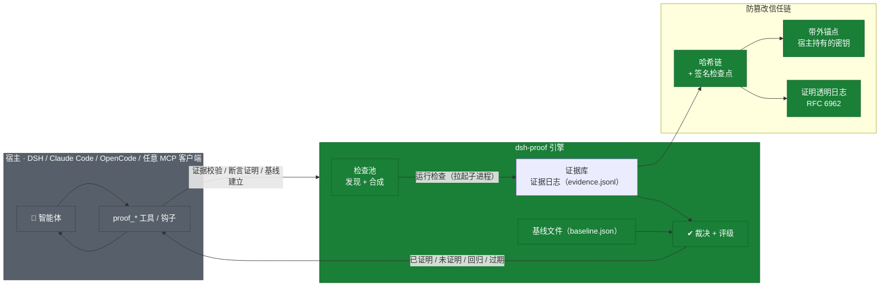
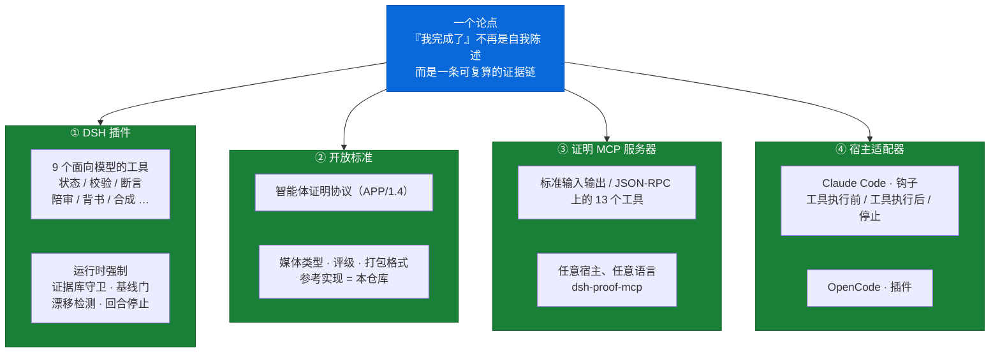
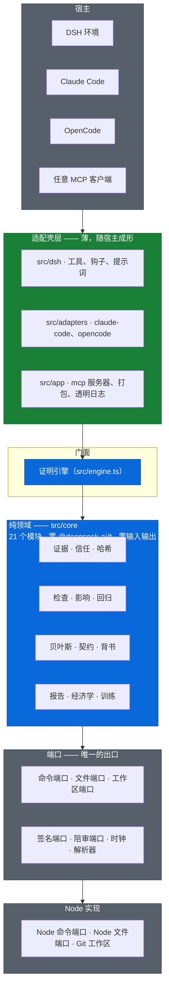
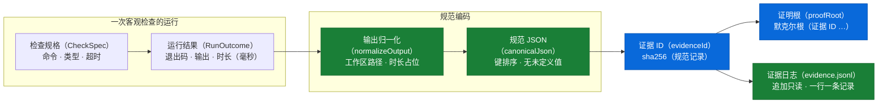
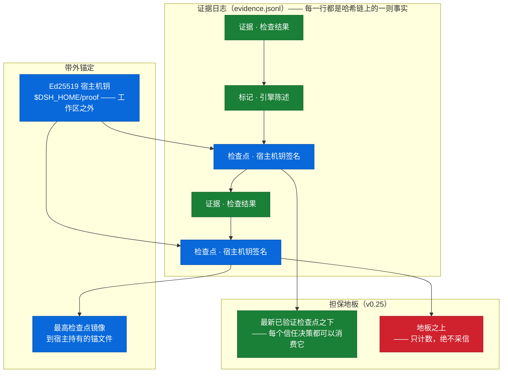
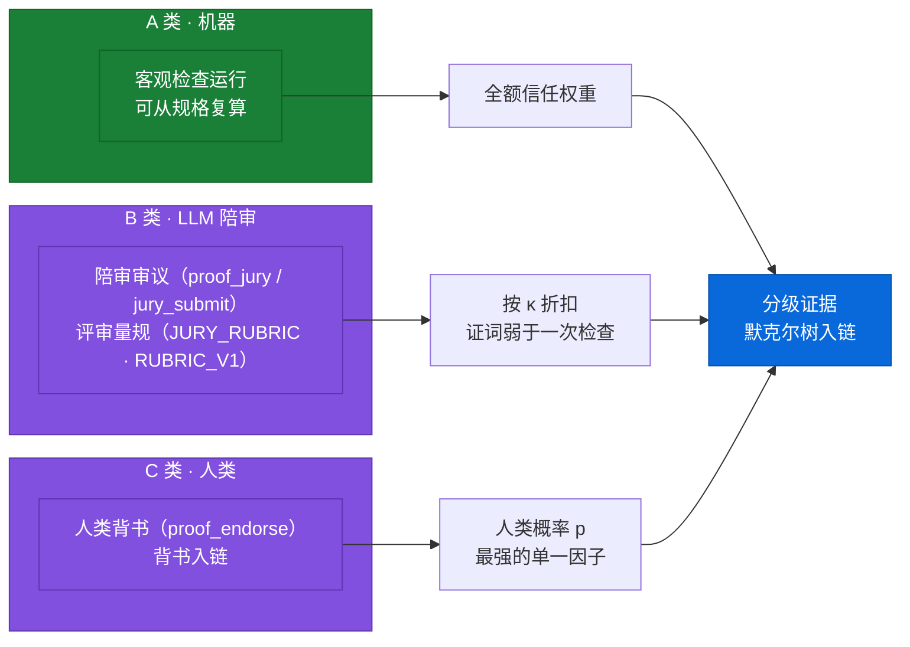
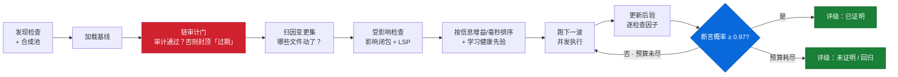
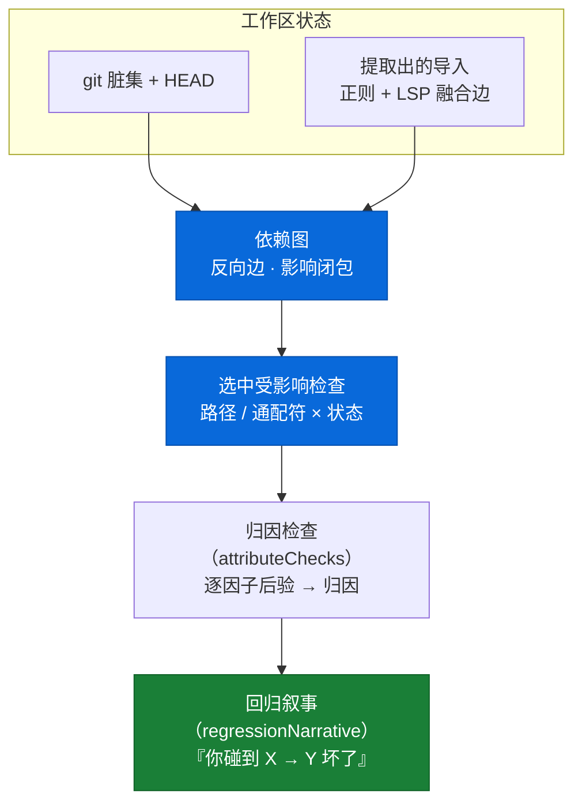
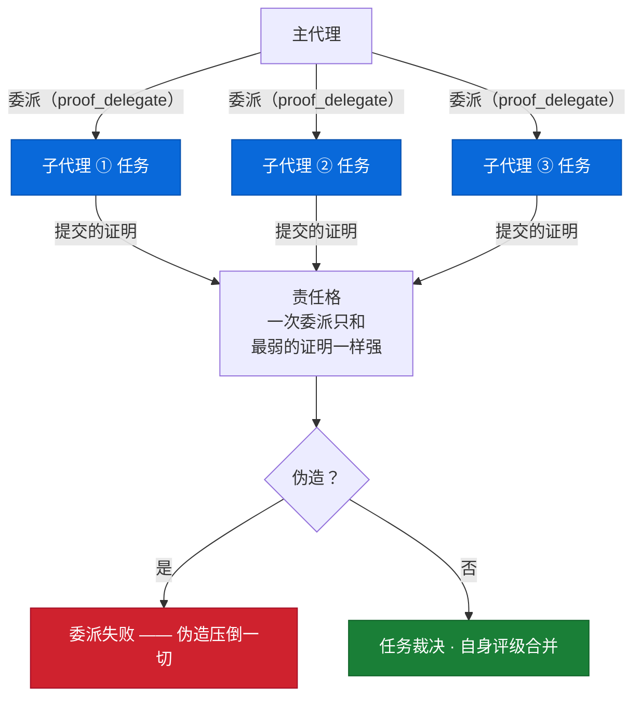
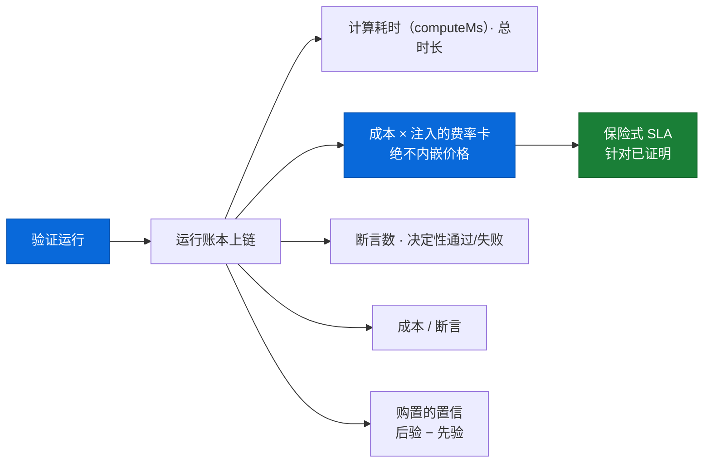

# dsh-proof

**证据驱动的完成证明与回归归因** — 一个开放标准、一台 Proof MCP 服务器、宿主适配器与一个 DeepSeek Harness 插件。


> 把**「我做完了」**从一句自我陈述，变成一条可复算的证据链。
> 把**「我修好了，但弄坏了别的」**从事后复盘，变成事中的归因。

```
$ proof_claim "修复了登录重定向 bug，并补了回归测试"
✓ PROVEN — 修复了登录重定向 bug，并补了回归测试
evidence root: 9f2c1ab47d0e
PROVEN (p≈0.97) — the claim is backed by evidence root 9f2c1ab47d0e:
3 check(s) passing, 0 regression(s), 1 pre-existing failure(s) left untouched.
```

📖 **[English](./README.md)** · 📜 **[Agent Proof Protocol](./PROTOCOL.md)** · 🔍 **[审计发现台账](./FINDINGS-LEDGER.md)**

---

## 缺口（The gap）

Agent 的 harness 会告诉你它**做了**什么；它不会告诉你那件事是否真的**work**。自我陈述由最希望被相信的一方写出——所以「我做完了」是一句主张，不是事实。

`dsh-proof` 把「完成」变成一条**可复算的事实**：

- 每次客观检查的运行都被记为**证据**——内容寻址、追加只读、哈希链相连；
- 链条由 agent 自己永远造不出的**签名检查点**封缄，并镜像到它永远够不到的**带外锚点**；
- 每一次变更都被**归因**到导致它的那次改动——事中判定，而非事后追查；
- 验证**裁决**——`proven` / `regressed` / `stale` / `unproven` / `no-baseline`——由重跑证据推导而来，从来不是向 agent 讨来的。

---

## 工作原理一览（How it works）



宿主通过 `proof_*` 工具表达意图；引擎运行客观检查，把实际发生的事记录在一条防篡改的链上，并返回一个第三方仅凭字节就能重新推导的评级。

---

## 一个论点，四个外壳（One thesis, four shells）



| 外壳 | 是什么 | 在哪里 |
|---|---|---|
| **DSH 插件** | 九个面向模型的工具 + 运行时强制 | `src/index.ts`、`src/dsh/*` |
| **开放标准** | Agent Proof Protocol **APP/1.4** —— 词表、寻址、链、bundle 交换格式 | `PROTOCOL.md`、`src/app/protocol.ts` |
| **Proof MCP 服务器** | stdio 之上的十三个工具；任意宿主、零 DSH 安装 | `src/app/mcp-server.ts`、bin `dsh-proof-mcp` |
| **宿主适配器** | Claude Code hooks 与 OpenCode 插件 —— 在工具调用的缝隙上执行强制 | `src/adapters/*` |

---

## 架构：纯核心，薄外壳（Architecture）



纯领域层（`src/core`）从不 import `@deepseek-ai/*`，从不打开 socket，从不读取 `process`。它需要的一切都经由端口进入——所以同一套核心既能跑在 DSH 下、跑在任意 MCP 客户端下，也能在带内存替身的普通测试套件里运行。

---

## 核心概念（Core concepts）

| 概念 | 含义 | 代码 |
|---|---|---|
| **Claim（断言）** | 一条**类型化**的完成声明，不是自由文本——它的 kind 绑定它所欠的证据义务 | `src/core/contract.ts` |
| **Evidence（证据）** | 一次检查的一次观测运行：命令、状态、输出摘要、工作区快照 | `src/core/evidence.ts` |
| **Verdict（判定）** | 基线→当前的差分结果——记功、记账，或诚实的中间态 | `verdictOf`、`src/core/evidence.ts` |
| **Grade（评级）** | 整次运行的结论：`proven` / `regressed` / `stale` / `unproven` / `no-baseline` | `decideGrade`、`src/core/report.ts` |
| **Baseline（基线）** | 日志上的具名视图：开工时每个检查的最新记录，外加一个 Merkle 根 | `buildBaseline` |
| **Checkpoint（检查点）** | 一条承诺「链头 H、N 条记录之后」的签名陈述——agent 伪造不了 | `EvidenceStore.checkpoint()` |
| **Anchor（锚点）** | 最高的检查点，镜像到工作区之外、签名密钥旁边——让截断可被发现 | `parseAnchor`、`src/core/trust.ts` |

---

## 证据自寻址（Evidence is self-addressing）

每条记录由其**规范**形式的 SHA-256 寻址——所以同一结果在任何机器上得到同一个地址，任何读者都能重新哈希一条记录、确认它指向自己。



键排序、`undefined` 丢弃、`-0` 与 `0` 一致、非有限数折叠为 `null`，非普通对象被**大声拒绝**——把两个不同的值混成一个地址，比崩溃更糟。哈希之前先归一化捕获输出（路径 → `$WORKSPACE`、时长 → `<duration>`、CRLF → LF），所以不同检出上的同一次失败是**同一条证据**。

---

## 信任模型：对手即被审计者（Trust model）

agent 能读写工作区里的每一个字节，包括证据日志——而且它熟悉协议自己的哈希函数，足以重写出一段自洽的历史。三道防线堵住这个洞。



1. **哈希链** —— 每一行通过 `prev = sha256(prevLine)` 链接到上一行：编辑、插入或删除任何中间行，都会断开通向下一条的链接。
2. **签名检查点** —— 对 `{count, head, workspaceKey, at}` 的 Ed25519 签名，在已知记录数处承诺链头。伪造者能重推导出每一份摘要，但伪造不了签名；走链者拒绝 count 或 head 与它实际走到的记录不符的检查点。
3. **带外锚点** —— 结束于锚点高水位之下的日志是**回卷（rewind）**；锚点自身的签名失败是**伪造锚点（forged anchor）**。
4. **担保地板（v0.25）** —— 每个信任决策只消费宿主机钥实际验证过的最新检查点**之下**的内容；地板之上的新鲜追加只计数、绝不采信。

---

## 三级证据（Three evidence classes）

验证不必全用机器。证词重新进入证明体系——**有分级，永不平等**。



- **A 类（机器）** —— 客观检查运行，可从 spec 复算。始终全权重。
- **B 类（LLM 陪审）** —— `proof_jury` 按 `JURY_RUBRIC` 审议；以信任指数 κ 折扣，因为证词弱于一次真正执行的检查——一个弱的因子只能**削弱**裁决，永远不能增强它。
- **C 类（人类）** —— `proof_endorse` 把一名具名人类的批准放到链上；最强的单一因子，由真实的宿主审批缝隙把关。

---

## 验证流程：认证到 0.97 就停，不跑完全部（Verification workflow）



`proof_verify` 把每个检查当一个贝叶斯因子：来自历史的健康先验、每次运行的成本、距变更集的影响距离（图闭包 + LSP 精化的边）。检查按**每毫秒期望信息增益**排序、分波运行，后验由真实结果更新——在 `P(claim) ≥ 0.97` 的那一刻停止。缺失的证据永不被粉饰：过不了自身审计的链，把所有评级封顶在 `stale`。

---

## 回归归因：谁弄坏的，事中定位（Regression attribution）



回归对照**基线视图**判定——开工时每个检查的最新记录。`pass → fail` 是记在本次会话头上的 `regression`；`fail → fail` 是 `still-failing`，**永不**记在会话头上；`error` / `timeout` / `aborted` 是非决定性——既不记功也不记账。归因叙事点明到底是哪些文件的变更选中了哪些检查。

---

## 断言即类型化契约（Claims as typed contracts）

自由文本断言比机器绑定得更弱。`proof_claim` 把一条断言升级为五种**类型化契约**之一，每种绑定自己的证据义务——只有当全部义务成立时 `proven: true` 才成立，否则 `blockers` 就是待办清单。


| 类型 | 义务（共享的零回归地板之外） |
|---|---|
| `behavior-preserving` | 公共导出面两个方向都不得移动 |
| `behavior-adding` | 每个被改动的源码路径都被一条通过的检查执行过 |
| `perf-budget` | 有一次处于声明预算之内的决定性基准测量 |
| `docs-only` | 变更集真的只是文档；跳过检查，置信封顶 |
| `llm-jury` | 有一条活跃的陪审审议支持断言原文 |

---

## 合成验证：为没有检查的地带（Conjured verification）

不是每条断言都有客观测试。`proof_conjure` 让 agent 为断言起草一条合成测试并**在链上**执行——被记录、被计价、被打折，永不与独立检查等值。


---

## 多代理问责：责任 DAG（Multi-agent accountability）

委派有多强，取决于树里最弱的那个证明。v0.19 起，委派出去的任务在链上铸造一条**证明义务**；父任务的 `proven` 以子任务的 `proven` 为前提；DAG 的每条边都是一份可被独立重验的 proof bundle。



---

## 验证经济学：信任的单位成本（Verification economics）

v0.21 起，每次被定价的运行都在链上留下一本**经济学账本**：花了多少算力、验证了多少断言、买到了多少置信、获得了多少信息——各按美元计。价格由**部署方注入**（`RateCard`），从不内嵌；换一张卡，同一份证据重新定价。



`confidencePurchased = posterior − prior`——一次运行真正**买到**的边际置信，任一侧从未被测得时为 `null`（永不为零）。`proof_sla_quote` 把 `proven` 评级精算成一份保险式报价；`regressed` 被诚实拒保，而且报价本身内容寻址上链——事后无法被悄悄改写。

---

## 工具面（Tool surface）

**MCP 服务器——十三个一致性工具**（APP/1.4），外加 DSH 插件的九个。所有结果都是规范 JSON。

| 工具 | 作用 |
|---|---|
| `proof_status` | 基线是否存在、发现的检查、链模式与完整性 |
| `proof_baseline` | 全量运行、记录证据、保存基线视图 |
| `proof_verify` | 分级裁决 + 逐检查判定 + 回归归因 |
| `proof_claim` | 类型化契约检查：义务全部成立 → `proven` |
| `proof_bundle` | 把 manifest + 日志 + 锚点组装成可携带的 bundle |
| `proof_publish` | 把最新签名检查点追加进透明日志 |
| `proof_log_verify` | 从透明日志自己的字节审计它 |
| `proof_delegate` | 铸造子任务的证明义务 + worker 指令 |
| `proof_delegate_submit` | 裁决提交上来的 bundle；锚点封顶评级 |
| `proof_task` | 全图概览，或单个任务的合成裁决 |
| `proof_training_export` | 把链蒸馏成带标签、链上锚定的数据集 |
| `proof_economics` | 在链上重放最近一次运行账本 |
| `proof_sla_quote` | 把 `proven` 评级精算成保险式 SLA |

陪审、背书与合成只活在 **DSH 插件面**——它们依赖开放服务器无法假设的宿主持有缝隙（审批提示、会话上下文）：`proof_jury`、`proof_jury_submit`、`proof_endorse`、`proof_conjure`、`proof_conjure_run`。

---

## 快速上手（Quickstart）

### 1 · Proof MCP 服务器 —— 任意宿主，零 DSH 安装

```sh
npm i -g dsh-proof        # 或：npx dsh-proof-mcp
DSH_PROOF_ROOT=/path/to/project dsh-proof-mcp
# 或直接从检出目录运行：
node --experimental-strip-types src/app/mcp-entry.ts
```

把任意 MCP 客户端指向它——Claude Desktop、Cursor、一切会说 MCP 的宿主：

```json
{
  "mcpServers": {
    "dsh-proof": {
      "command": "dsh-proof-mcp",
      "env": {
        "DSH_PROOF_ROOT": "/path/to/your/project",
        "DSH_PROOF_TRUST_DIR": "/path/to/trust/root",
        "DSH_PROOF_EVIDENCE_STORE": "host"
      }
    }
  }
}
```

首跑：`proof_baseline`（每个发现的检查跑一次；签名链与锚点就此建立）→ `proof_verify`（分级裁决）→ `proof_claim`（证明一条断言）→ `proof_bundle`（打包移交）。

### 2 · DSH 插件

```sh
dsh plugin --profile web add dsh-proof        # 从 registry
dsh plugin --profile web add ./dsh-proof      # 从本地检出
```

### 3 · Claude Code —— hooks 执行服务器做不到的强制

登记工具面，然后把 hooks 粘贴进 `.claude/settings.json`：

```sh
claude mcp add proof -- dsh-proof-mcp
```

```json
{
  "hooks": {
    "PreToolUse":  [{ "matcher": ["Write", "Edit", "MultiEdit", "NotebookEdit", "Bash"],
                      "hooks": [{ "type": "command", "command": "dsh-proof-cc pre-tool-use" }] }],
    "PostToolUse": [{ "matcher": ["Write", "Edit", "MultiEdit", "NotebookEdit", "Bash", "Read"],
                      "hooks": [{ "type": "command", "command": "dsh-proof-cc post-tool-use" }] }],
    "Stop":        [{ "hooks": [{ "type": "command", "command": "dsh-proof-cc stop" }] }],
    "SessionStart":[{ "hooks": [{ "type": "command", "command": "dsh-proof-cc session-start" }] }]
  }
}
```

### 4 · OpenCode

合并进你的 `opencode.json`（从检出目录接入请先 `npm run build`）：

```json
{
  "plugin": ["dsh-proof/lib/adapters/opencode/plugin.js"],
  "mcp": {
    "proof": {
      "type": "local",
      "command": ["dsh-proof-mcp"],
      "environment": { "DSH_PROOF_EVIDENCE_STORE": "host" }
    }
  }
}
```

完整带注释示例：[claude-code.settings.json](./examples/claude-code.settings.json)、[opencode.json](./examples/opencode.json)。

---

## 配置（Configuration）

一切可调项都是配置字段——没有硬编码。MCP 服务器、两个适配器与 `dsh-proof-ptl` 都由环境变量配置：

| 环境变量 | 含义 | 默认 |
|---|---|---|
| `DSH_PROOF_ROOT` | 要验证的工作区根 | 进程 cwd |
| `DSH_PROOF_TRUST_DIR` | 信任根——密钥、锚点、适配器会话 | `$DSH_HOME/proof` |
| `DSH_PROOF_EVIDENCE_STORE` | `host`（工作区外）\| `workspace`（`.proof`，受守卫） | `host` |
| `DSH_PROOF_EVIDENCE_DIR` | 工作区相对证据目录（仅 workspace 模式） | `.proof` |
| `DSH_PROOF_PTL_DIR` | 透明日志目录 | `<trustRoot>/ptl` |
| `DSH_PROOF_REQUIRE_BASELINE` | 基线门：`off` \| `warn` \| `ask` | `warn` |
| `DSH_PROOF_DRIFT` | `0` 关闭漂移检测 | 开 |
| `DSH_PROOF_ENFORCE_TURN_END` | `0` 关闭回合结束提醒 | 开 |

插件级旋钮（`cordis.patch.yml`，见 [examples/cordis.yml](./examples/cordis.yml)）：`checkpointEvery`、`autoDiscover`、`checks[]`、`checkTimeoutMs`、`verifyBudgetMs`、`concurrency`、`impactGraph`、`lspImpact`、`certifyTarget`、`requireBaseline`、`driftDetection` 等。

---

## 开发与验证（Development & verification）

```sh
npm test                 # 33 个文件 · 1099 个测试，Node 自带 runner + type stripping
npm run typecheck
npm run build
```

- **纯核心可测** —— `test/helpers.ts` 为每个端口提供内存替身，整个引擎无需 harness、git 或 shell 即可运行。
- **对抗套件** —— `test/09-trust` 攻击信任链；`test/22-bundle` 攻击交换格式；`test/23-mcp` 以真实子进程驱动真实服务器；`test/25-cc` 在真实子进程上测真实 Claude Code 协议。
- **主张即契约** —— `test/32-claims.test.ts` 把架构主张钉在生产调用面上：一个烂成「建了但没人用」的承诺会让套件变红。
- **七轮审计** —— 27 个 agent 的对抗审计在 v0.13–v0.26 关闭了 34 条高危发现；完整台账在 [FINDINGS-LEDGER.md](./FINDINGS-LEDGER.md)，并由 `test/33-ledger.test.ts` 钉住。

---

## 诚实边界

公开说清，从不隐藏——完整清单见下文：

- **静态检查发现不是沙箱。** 检查是项目自己的构建元数据；插件做编排与归因，不做沙箱。
- **尾部记录有链覆盖、无检查点覆盖。** 最后一个检查点之上的窗口由节奏界定，并在每个 baseline/verify/claim 边界闭合。
- **V8 覆盖防御是隔离 + mtime 时间窗，不是密码学。** 窗口内的同进程伪造抬高的是成本，不是不可能——文档如是说。
- **锚点可能不可读。** 在另一台机器上或密钥轮换之后，锚点检查会被**跳过**而非失败——回卷覆盖丢失，链与签名覆盖不丢。
- **适配器会话账本是行为缓存，不是信任锚。** 真正的信任活在签名证据日志里；损坏的会话文件被大声重置，绝不静默采纳。
- **无签名链没有地板。** 每一行的可信度等于持有它的文件系统的可信度——审计如实这么说。

### 完整清单（按版本追记）

- **检查发现是启发式的。** 复杂 monorepo、自定义构建系统、Bazel/Nx/Turborepo 编排请用 `checks` 显式配置，并给出 `paths`，增量验证才会精确。
- **依赖图是近似的。** 动态 `import()`、多行 ESM import 与 Python dotted import 已在 v0.7 纳入解析；反射与运行时字符串拼接的路径仍然无法解析。近似**偏向过覆盖**（多跑一次，绝不漏判）。
- **claim 后验是独立乘积近似（v0.9）。** `confidence` 是各检查健康概率的连乘，隐含「检查相互独立」——共享同一批变更文件（或同一夹具、同一套测试跑两遍）的检查，失败是**相关的**，乘积会高估证据强度。这是模型已知最大的失真源；替代方案（对全部检查建模联合分布）恰恰需要我们没有的真值数据。所以这个数应读作**排序信号而非标定概率**，下游不得把它表述成赔率。
- **β = 0.02 是承认的猜测（v0.9）。** 假阴率（工作区坏了、检查却绿）需要「确实断了」的标注数据才能学习，而证据日志只记录观测，没有「真值断裂」一列。固定常数是诚实的猜测；在这里学一个数出来才是假精确。α 同理只是粗糙估计（flips 只配对决定性观测、分母含全部记录，interleave 时偏低——记为粗糙，不假装修正）。
- **certified-subset 的跳过以先验形式留在账上（v0.9）。** 提前认证没跑的检查不是被忽略：每个都以 `skippedByPlan` 记录（携带各自先验）、随 `proof/verified` marker 入链、可审计，剩余不确定性如实进入后验。先验只和证据日志一样好——日志短的检查先验保守（ρ = 0.2 起步），这是设计而非缺陷。
- **摘录是记账的省略，不是无损摘要（v0.8）。** 预算约束的是 `text` 总长——省略 marker 与连接换行同样计入；对账字段是 `keptOriginalChars`（`omittedChars + keptOriginalChars === normalized.length` 严格闭合），不要用 `text.length` 对账（marker 会虚增它）。`head` 策略是恰为 budget 的逐字切片，同样满足 `text.length <= budget`。
- **检查点存在窗口期（v0.2）。** 最后一个签名检查点之后的记录受哈希链保护但不受检查点保护；窗口由 `checkpointEvery` 界定，且每次基线/验证/断言边界都会闭合它。窗口内截删不再是不可见的：`proof_status` 的 `tailRecords` 直接暴露最后一个检查点之后还有多少条记录。删除锚点文件可以造成「回滚不可检测」——锚点因此放在智能体沙箱之外；若整台主机被攻陷，本插件的威胁模型不适用。
- **半行恢复只修尾行撕裂（v0.8）。** 启动时只把「有前缀、没有闭括号」的**最后一条**残行原子重写掉（并落 `log/recovered-partial-tail` marker）；完整行的损坏不恢复、不改写——那可能是篡改，审计继续报。崩溃恢复与篡改检测的界线就在这里：撕裂是崩溃的物理签名，整行重写不是。
- **签名密钥的边界。** 密钥防的是「被审计的智能体」，不是「能读宿主文件的人」；主机被完全攻陷时一切本地信任机制都失效。在**没有 signer 的机器**上（密钥丢失、换机器审计），带签名的检查点无法本地裁定——审计报告为 `unverifiableCheckpoints`：这是**能力缺失，不是伪造指控**，audit 不会因此失败；rewind 覆盖也不依赖密钥（锚的 count/head 比较仍然约束日志）。
- **`killedBySignal` 的平台边界（v0.8）。** 该字段只在子进程能如实报告信号死因的平台上出现；win32 下恒缺省——Windows 不跨进程传播信号。信号死亡在本插件记 `error` 并注明信号（不再误判为超时），但 Windows 上外部击杀只能表现为退出码/错误，插件不会编造一个信号名。
- **API 面是正则提取的保守过报近似（v0.10）。** 逐行正则看不见运行时动态生成的导出（动态计算的导出名、字符串拼出的再导出）；提取刻意偏向过报——漏报一个导出等于漏掉一次破坏性变更（错误通过），多报只是让诚实的断言多干活（错误失败）。入口推导依赖 `package.json` 声明与存在性探测，声明与真实入口不符时请显式配置 `apiEntryPoints`。
- **docs-only 的陪审是自证，不是实验（v0.10）。** `review` 是作者自评：confidence 封顶 `juryConfidenceCap`（默认 0.80）、basis 为 `jury-only`、叙事直说 `self-attestation is capped`。这个数是**上限不是测量**，不得当作实验证据引用。
- **perf-budget 的 `durationMs` 受机器噪声影响（v0.10）。** 预算判定基于 wall-clock 时长测量，受机器负载、频率漂移与并行进程影响，跨机器不可比。`budgetMs` 应留余量，边界值附近的判定波动是预期行为而非回归。
- **B 类证词的独立性只有最弱档（v0.11）。** `independence` 分档为 `same-session` / `fresh-context` / `isolated-model`，而本版工具实际写入的是 **`same-session`**——陪审在作者智能体自己的上下文里审议，污染风险最高的一档，链上如实标注。模型身份同样是**提交方声明而非可验证事实**（插件无法验证应答者是谁），记为 `'session-model (unverified)'`；能抓住冒名顶替的不是声明，而是第三方拿同一 prompt 重放比对输出的审计。权重（`classBTrust` 0.7）是声明的策略常数，不是从数据里学出来的——不存在「这个证人历史上对了几次」的标注集。
- **陪审的 `probability` 是主观概率，不是测量（v0.11）。** 量规要求陪审报告「你的推理真正支持的那个数」，但 LLM 的自报数字没有对标任何频率保证；p=0.99 与 p=0.9 的差别应读作措辞强度而非校准差距。全部证词数学（p^w、混合）都是在**消费**这个主观数，不会让它变得更客观。
- **`humanProbability` = 0.95 是建模选择（v0.11）。** Class C 的审批缝隙是二值的（批准/驳回），不采集数字置信，于是人类「对」的概率以常数 0.95 入账——不是测量，也不该被调参成「看起来能过 0.97 目标」的值。0.95 < 1 是刻意的：永不犯错的人类背书会让每条被背书的断言不可证伪。
- **可靠性混合是评分规则选择，不是推导出的后验（v0.11）。** `fuseConfidence = (1−w)·c + w·p` 把「证人以概率 w 可靠、否则是噪声」建模为线性期望——选择「混合」而不是「乘积」，是因为机器认证已存在时证词谈论的是**整个断言**而非又一个独立因子；它不是从任何先验推出的后验，边界情况（w→0 保机器数、w→1 采纳证词值）是设计锚点而非定理。两套数学各有其位：纯陪审路径用 p^w 折扣（只能弱化），融合路径用混合（可救活也可崩塌）——用哪套由「机器是否已经说话」决定，而不是由哪套数字好看决定。
- **静态筛检不是沙箱（v0.12）。** 合成脚本的执行前置筛检是文本层 deny-list：计算式 specifier（`import(buildName())`）、别名通道（`createRequire` / `eval` / `new Function`）与大小写混淆的 specifier 它看不见——文本看不见运行时值。真正约束失控脚本的是沙箱 cwd 限制、执行超时（`syntheticTimeoutMs`）、输出摘录上限与宿主将来的 ptc-runtime 档位；筛检的职责只是让**容易的**外联尝试在执行之前大声失败。档位标签因此如实写 `'screened-subprocess'`，不冒充沙箱。
- **合成 β = 0.15 是承认的猜测，而且这个数按构造学不出来（v0.12）。** 假阴率需要「确实断了」的真值标注才能学习，而一条自利的测试（空断言、漏掉会破的输入）按构造**不产生任何可学的破坏信号**——日志里它永远是绿的。0.15 与 0.02 一样是定价立场而非测量；它刻意放在可覆盖的 `syntheticFalsePass` 而不是「不再重调」的 `BAYES_CONSTANTS` 里，正因为它是建模猜测，不是定律。
- **合成覆盖永远弱于 organic 同侪（v0.12）。** 同样一次 pass，合成检查的后验抬升天然更少（端到端：synthetic ≈ 0.9706 < organic ≈ 0.9960）；义务 tier ladder 里合成让路于同档 organic；全部决定性记录皆合成时 basis 改名 `synthetic` 并在叙事里点名折扣。合成覆盖应读作「断言作者自己跑过并通过的验证」，不是独立确认——三层机制（β、tier ladder、basis）编码的都是这同一句话。
- **执行覆盖是文件粒度（v0.13）。** v1 的「执行过」= 文件有任一函数的任一 range `count > 0`——它不区分执行了变更的那几行还是同文件的隔壁函数，一个只触达未改代码的测试与真正执行变更的测试在此粒度下等价。行级/符号级判定（需要基线内容 blob 或 LSP 符号映射把变更定位到行/符号）是演进方向，不是本版能力；读 `change-executed` 时请记住它说的是「这个文件」，不是「这一行」。
- **非 node 生态没有覆盖数据（v0.13）。** `NODE_V8_COVERAGE` 是 Node 运行时开关：pytest、go test、cargo test 等进程继承变量但不产 V8 profile，覆盖维度对它们是 `basis: 'none'`——observe 不拦（该生态永远不门控），require 则每条断言都 unproven。这是部署决策不是缺陷：纯 node 工具链可放心 `require`，混合/非 node 生态请留在 `observe`，或干脆 `off`。
- **「加载未执行」桶未参与更强判定（v0.13）。** V8 报告天然携带第三种事实——文件被 import 但从未跑过一行；v1 解析并保留该分桶，却只把**执行**用于门控。「加载未执行」本是「依赖图以为它会被用到、实际没有」的现成证据（更强的嫌疑文件排序、更精确的 `new-paths-covered`），v1 未消费——保留为演进，如实记在这里。
- **MCP 面是十三个一致性工具。** `proof_status` / `proof_baseline` / `proof_verify` / `proof_claim` / `proof_bundle` / `proof_publish` / `proof_log_verify` / `proof_delegate` / `proof_delegate_submit` / `proof_task` / `proof_training_export` / `proof_economics` / `proof_sla_quote`。`proof_jury` / `proof_jury_submit` / `proof_endorse` / `proof_conjure` / `proof_conjure_run` 刻意不经 MCP 暴露——它们依赖宿主持有的缝隙（人工审批提示、会话上下文、隔离的审议模型），开放服务器无法假设。想要证词与合成的客户端请在 DSH 内跑插件，审批缝隙在那里。
- **bundle 验证不替代本地审计（v0.14）。** 验证方从 bundle 自己的字节重导出一切——文件摘要、链链接、逐条自寻址、基线摘要——但检查点签名只在验证方持有（或被交给）点名密钥时可裁定，锚单调性只在锚文件可用时才检查；裁定的能力缺失如实记录，绝不四舍五入成伪造指控。没有锚的 bundle 保得住链与寻址保证，丢掉的是回滚覆盖。
- **检查点 count 自 v0.14 起是规范性的。** `count` 不是安全整数、或不等于走链实数记录数的检查点，无论谁签，一律进 `malformedCheckpoints`；锚比较只采信锚 keyId 匹配的检查点——伪造检查点（外来 keyId、虚报 count）不再能洗白截断。反面同样对称：一个诚实但数错了 count 的有 bug 生产方会被同样拒绝，没有豁免通道。
- **shell 命令字符串是所有宿主共有的溯源盲区（v0.15；守卫半边已于 v0.22 关闭）。** Bash/shell 类工具不携带结构化路径——`sed -i … src/a.ts` 这样的命令对**归因**什么都提取不出来，DSH、Claude Code、OpenCode 三个宿主同此洞，且是刻意为之（在命令行里挖「长得像路径的词」只会指纹出噪声）。shell 写出的文件没有指纹、没有触达归因；兜底是漂移检测——shell 改动先前观察过的文件仍会被抓到（字节与记录的指纹不再匹配）。逃逸的只有**全新** shell 建立的文件的归因——想要被记账与归因的改动，请用 Write/Edit。v0.22 补上的是守卫半边：**提及证据库或信任工件**（任何拼法、两种工作区身份）的 shell 命令在执行前即被拒绝。
- **OpenCode 没有回合结束缝隙（v0.15）。** 没有 Stop 钩子、事件总线形状不稳，漂移与一次性 baseline/verify 提醒只能锚定在下一次工具调用上——外部改动后的第一个调用被持起并给出漂移叙事，且每个不同漂移集每个插件生命周期至多浮出一次（被无视的消息不能永远扣押后续调用）。`ask` 判定在这个宿主上也走不了用户审批往返：`ask` 与 `deny` 都持起调用，理由说明该改做什么。
- **超时如今是被观察的状态，不是推断（v0.16）。** 命令端口上报 `timedOut` 标志，真实超时的检查在两个平台上都记 `'timeout'`——此前生产端口报告不了这个死因，真实超时全被记成普通 `error`。边界仍在原处：信号死亡在能报告的平台上仍记 `error` 并注明信号（见 v0.8 条），Windows 上以普通退出码到达的击杀仍读作 `error`——插件只报告端口观察到的，绝不多说。
- **本会话用过 shell 后，`external` 降级为 `unknown`（v0.16）。** 「不在 touched 集」曾被读作外部改动的肯定证据——可会话一旦用过 shell（其路径任何宿主都提取不了，见 v0.15 条），这个缺失可能只是 agent 自己的 shell 工作没有被归因。归因如今对此说 `unknown`，不说自信但可能错指的 `external`，漂移叙事与外部嫌疑记账都读这个降级；`external` 只在本会话确实没有能产出该改动的手段时保留。
- **MCP `serverInfo.version` 就是包版本（v0.16）。** `initialize` 应答 `MCP_DEFAULT_VERSION`，随发布纪律与 `package.json` 保持同步，并被 `test/23-mcp` 的握手断言钉死——它是**实现版本**，不是协议能力声明；协议兼容性另行协商（`2025-06-18` 等）。
- **合成 deny-list 增补 process 系（v0.17）。** `process` / `node:process` 进入禁用清单，文本层能看见的拼写——反引号模板、`\u`/`\x` 转义、`node:` 前缀——先解转义归一再匹配，`import { env } from 'node:process'` 不再绕过 env 读取检查。增补对诚实脚本**按构造非破坏**：脚手架协议经全局取 process 状态（`process.exitCode`，无需 import），正当的合成测试分毫无损。清单看不见的仍是它从来看不见的——运行时计算的 specifier 与别名通道（见 v0.12 条）：文本不是沙箱；且清单是与引擎钉死的契约，增补是对宿主强制面的破坏性变更，不是随手编辑。
- **canonicalJson 对普通 JSON 单射，对非有限数刻意不单射（v0.17）。** bigint/symbol/function 与非普通对象（`Date`、`Map`、类实例……）抛 `TypeError`，不再静默折叠成别的值已占有的字节——两个 payload 不再可能铸出同一个 evidenceId。`NaN`/`±Infinity` 维持折叠为 `'null'` 的 legacy 行为，如今显式 pin 为决策而非事故：裁定读路径吃的是 `JSON.parse` 出来的数，伪造的 `"count": 1e999` 会 parse 成 `Infinity`——在那里 throw 会把审计当场崩掉，而不是把检查点裁定为 malformed；折叠已经产出正确裁定（验签失败，且走链的安全整数门点名这个谎）。改成 throw 被这些调用点的前置门挡着，是待办不是疏忽。
- **透明日志是单操作者日志（v0.18）。** v1 规范的就是一个操作者、一份文件日志。密码学保证的是日志自身历史不可被无感改写——改一字节根必动、截断树必缩，二者都过不了签名树头或一致性证明，回退防护再拒一层（缩树、同树换根、回拨时间戳的新头一律拒绝）。它抓不住的是**分叉视图（split-view）**：一个向不同验证者出示不同树的操作者，任何单一日志都无法识破——识破它需要多见证或审计者间 gossip（完整的 certificate transparency 答案），明确列为 future work，文档不声称它。
- **透明日志不验证工作区签名（v0.18）。** 日志按设计是哑公证——逐字托管检查点的 `{count, head, at, sig, keyId}`，从不裁定 `sig`。拿工作区公钥裁定工作区签名始终是审计者的独立工作；一条已发布的条目证明的是**发布**这一事实有序且未被回写，从不证明被发布的字节是诚实的。
- **引擎不能重跑子工作区的检查（v0.19）。** 子代理的检查跑在另一个工作区、对着另一份基线，引擎重演不了。`artifactVerified` 是 bundle 验证——结构、摘要、链——不是重新执行；`claimedGrade` 缺省因此刻意两值（验过且带基线 → `proven`，其余 → `no-baseline`），细等级（`unproven`/`stale`/`regressed`）全靠提交方**显式声明**。谎报的定价是伪造规则：声明了 artifact 撑不住的等级——尤其虚报 `proven`——一律记 `regressed`、豁免免疫；声明买不来字节撑不住的任何东西。
- **dsh 的 agent-team 缝隙未稳定（v0.19）。** dsh 已发布的插件类型没有 team 接口，实验桥（`agentTeamBridge`，默认 false，opt-in）因此对 4 个候选事件缝隙做运行时鸭子类型探测并优雅降级——每个事件从 `unknown` 收窄、每个订阅各自 try/catch、任何路径不向宿主抛异常。dsh 构建若不发出任何被探测的事件，桥就保持静默（至多一行 stderr）；显式驱动（MCP 或引擎的委派三工具）始终是第一等路径，与桥无关。
- **训练 reward 表是成文惯例，不是客观真理（v0.20）。** 标签底下的判定是机器验证的基线差分，但 1.0 / 0.5 / 0.0 的定价（`VERDICT_REWARD`）是声明的政策，逐 manifest 快照——不同意 `still-failing = 0.5` 的消费方必须自行重定价，而快照恰好告诉他重定价的对象是什么。flip 配对同样是相邻启发：「相邻」是导出日志决定性子序列里的相邻，不是「两次观测之间世上什么都没发生」的断言。
- **`private` 档去掉的是输出文本，不是上下文（v0.20）。** private 导出零输出字符，但仍携带工作区路径与输出 digest——路径本身可能敏感，digest 可以印证一个猜测。数据集消费方即使拿到 private 档也欠这份数据一份小心。
- **跨部署合并数据集的信任问题未解（v0.20）。** 把多个导出方的数据集并到一起，就要回答「这是谁的数据？被投过毒吗？」——本版不回答。把数据集来源锚进透明日志（防 data laundering）是未来方向，不是 v0.20 的属性。
- **经济账本的费率卡是注入的成本基础，不是真实账单（v0.21）。** `computePerMs` 与 `humanReviewPerItem` 是部署方对「一毫秒验证算力、一件人工评审值多少钱」的**声明**，账本只和卡一样诚实——包里没有任何东西知道你的验证算力实际花了多少钱。换卡重定价是特性（同一条链、不同成本基础、各自对账），但读数时请记住它计价的是声明价，不是发票。
- **`pUndetected` 是模型概率，不是精算理赔史（v0.21）。** `1 − confidence` 溯源自 v0.9 的断言后验，带着该模型全部已声明的失真（独立性假设为首——见 v0.9 条）；没有任何损失数据喂给它，也不带任何理赔历史的标定。把它当风险**排序与定价的模型基础**，不要当经验费率。
- **SLA premium 是示意性、基于模型的报价，不是金融产品（v0.21）。** `dsh-proof/SLA-1` 背后没有监管、没有准备金、没有理赔流程——它与训练 reward 表（v0.20）同一精神、同一限度：给残余风险定价的**成文惯例**。另外 `infoNats` 为负值的意思是这笔钱买到了**坏消息**（断言概率下降了）——那仍然是信息，账本按符号如实入账，计的是「学到了什么」，不是「舒不舒服」。
- **shell 守卫是保守子串匹配，不是解析器（v0.22）。** 守卫把两侧的大小写与分隔符折叠后，拒绝一切文本上**提及**证据库或信任工件的命令——这意味着**改写后避开全部受卫拼法**的命令（环境变量间接、折叠恰好漏掉的大小写变体、把写入交给一个脚本文件）仍可能溜过。选择是刻意的：解析器漏掉的会比抓住的多，所以守卫宁可误拦并点名理由；漏过归因的一切仍由漂移检测兜底。
- **V8 覆盖防御是隔离 + mtime 时间窗，不是密码学（v0.22）。** 每轮验证在各自的暂存目录收集，只采纳 mtime 落在本轮窗口内的 profile，窗口外一份即整轮降级 `basis: 'none'`。买到的是抬高的伪造成本——被检进程必须在与引擎时钟的赛跑中写进引擎本轮自己的暂存目录，而不是仅仅继承环境变量——**不是不可能**：能以窗口内 mtime 写进当前轮目录的进程仍然能击穿它。
- **PTL 操作者密钥只有在信任根已知时才与日志分离（v0.22）。** 设置了 `DSH_PROOF_TRUST_DIR` 时密钥落在 `<信任根>/ptl-operator-key`，在它公证的日志目录之外；未设置时可能解析到 `<ptlDir>/ptl-operator-key`——就在它签名的树旁边，正是审计点名的自指。显式传 `--operator-key`（或设 `DSH_PROOF_OPERATOR_KEY_DIR`）即可分离；密钥仍在 `<日志目录>/operator-key` 的 pre-0.22 旧日志，显式传该路径即可继续验证。
- **`proven` 允许存在预置红灯。** 一个本来就红的仓库不该让 Agent 无法工作。预置失败会在报告里显著列出，但不计入本次会话的责任。这是刻意设计，不是漏洞。
- **它不替代测试本身。** `dsh-proof` 编排并归因你已有的客观检查。v0.12 的证据合成也不改变这条边界：断言由 agent 起草，插件只冻结脚手架、筛检、执行，并把结果折价记账为弱于任何独立检查的证据。
- **DSH 是 v0.1/0.2 开发者预览版。** 插件契约会变。本插件已把依赖面最小化并钉死契约快照（`src/vendor/dsh-tools.ts`），但上游变更时仍需重新对齐。
- **担保地板（vouched floor）是签名部署的纪律（v0.25）。** 每个信任决策只消费「本主机密钥真正验证过的最后一个检查点」以下的内容，地板之上的新鲜追加只计数、绝不采信。未签名链没有地板、整链可读——这就是「以未签名模式运行」的全部含义，审计会如实说明，而每一行未签名内容的可信度等于它所在的文件系统。
- **适配器会话账本是行为缓存，不是信任锚（v0.26）。** 其摘要绑定内容而非作者身份——主机上任何进程都能对伪造账本重算出合法摘要，同用户伪造因此静默加载。信任真正消费的记录是签名证据日志；损坏的会话文件会被广播并重置，绝不越过链的担保被静默采纳。
- **委派豁免在库边界认证的是知识，不是身份（v0.26）。** 签发工作区的键是链上公开字符串，直调引擎且知道该串的调用方即可接受风险；MCP 面根本不暴露 waive，锚键路径要求持有私钥，且每次豁免（或被拒尝试）都是可见的链上事实。
- **直接构造的 `ProofEngine` 不传 `workspaceKey` 时共享字面身份 `'default'`（v0.26）。** 工作区身份拒绝（发布洗钱、外来检查点引导告警）比对的身份，是每个接线面从根派生的——库嵌入方必须自传，否则身份防御在比对 `'default' === 'default'`。
- **验证视图的 `maxLine`/`sinceLine` 窗口切的是当前裁定池，不是第 N 行当时的物理池（v0.25）。** "as of" 语义对位置成立、对历史裁定状态不成立；该参数没有生产消费者，仅为取证工具存在。
- **收养头之前的合成 run 标记在混代链上静默蒸发（v0.25）。** 只要存在任何带见证的 `synthetic/run`，收养前的一半就退出 ran-set（诚实方向——拒绝相信无见证者），恢复手段是重跑 conjure；首次混代本身不打标。
- **锚的回卷应答可被移植检查点副本消音（v0.25）。** 携带锚自身 `(count, head)` 的行能应答比较，而走链的 head-mismatch 审计保持红、预签名拒签——检测与拒签补偿之，消音本身不单独打标。对称地：被拒签名的候选刻意留在发布池里（first-verifiable-wins），消费者必须先裁定再信任 `candidates[0]`；引擎发布选择在共享候选核心之外还留着一个死参数、自行重推导。
- **地板扣留的证词在链上可见，不总在工具回复里可见（v0.26）。** `aboveFloorAttestations` 落在 claim/jury 标记上，而工具回复可能指示一次能自愈的重交——重宣的检查点落在地板之下。同一可见性缝隙反向存在：MCP 面转发 drift/vanished 警告（v0.25.1）但尚无测试钉住该转发；宣誓后的补签检查点失败同样降级为返回注记里的警告，其失败路径亦无测试钉。
- **LSP 累计预算是墙钟，不可注入（v0.25）。** 钉预算耗尽的测试烧真实时间，耗尽的预算在拒绝前仍按导入站点各付一次 stat。降级诚实——null 答案从不收窄选择——但接缝不诚实。
- **测试替身是近似（v0.26）。** `MemoryFs` 在 `removeDir` 下保留 mtimes，`readDir` 对只含空子目录的父目录答 `undefined`；`FakeCommands` 规则全表最新优先，仅携带 `'node'` 的 argv 可能与后加规则相撞。测试靠构造避开陈旧状态依赖而非检测它；`FakeSigner` 自 v0.25 持有真密钥，但端口级保真永不完全。
- **字符串上界跨面不一致（v0.26）。** DSH 面把工具参数截到 4096 字符，MCP 面整文转发 claim（超 200 警告）——超过上界的 claim 两面哈希出不同规范 id。请用 200 字符说完；链上记录本就截在那里。
- **担保地板自身的残余债是刻意且可见的（v0.26）。** 地板按信任动词逐次重算——攻击者追加垃圾检查点让每个动词都付失败的验签（诚实计数、有价 CPU）；发布拒绝标记可能过度描述从未裁定的 skipped 候选；外来检查点引导告警无视 verbose 标志发出（只多不少）。没有一条是信任倒置，全部是已定价的可见性。
- **钩子接线由宿主配置（v0.23）。** 随包示例的 matcher 枚举宿主的变异工具名——名单外的工具根本不触发 PreToolUse 闸门，而插件自身的分类对它见到的任何名字都是全量的。实验性 agent-team 桥的映射恢复同样只读 suspect 过滤后的 store、不读担保地板——该缝隙默认关闭、显式选择启用。
- **claims 契约混用行为齿与静态齿（v0.26）。** 承重的是行为半边（真实 jury 流程、落在已签名检查点之下的宣誓字节）；静态负例仍可能被非常规格式满足，引擎发布叶子身份的钉弱于 CLI 面孪生，两条差分测试在干净侧无绝对锚，拒签赦免循环只跑一轮（闩锁式赦免仍会通过），受保护名单断言是快照清单而非前缀族本身。

---

## 版本历史（Version history）

| 版本 | 落点 |
|---|---|
| v0.15 | 开放标准（APP/1.0）+ Proof MCP 服务器 + Claude Code / OpenCode 适配器 |
| v0.16 | 诚实性收口：这一轮到底观察到了什么？ |
| v0.17 | 数学被修正，未测的缝隙被闭合 |
| v0.18 | 证明透明日志（RFC 6962）——交付历史可公开核验 |
| v0.19 | 跨代理责任 DAG |
| v0.20 | 训练数据飞轮——部署复利成数据资产 |
| v0.21 | 验证经济学——信任的单位成本、SLA 定价 |
| v0.22 | 27 个 agent 对抗审计，34 条高危全部关闭 |
| v0.23 | 统一验证读取——每个信任决策只走一扇门 |
| v0.24 | 主张即契约——承诺一旦失真，套件当场变红 |
| v0.25 | 担保地板——最后一条信任缝隙，从根部关闭 |
| v0.26 | 名册与门——最后两条新鲜追加通道关闭 |
| v0.27 | 账本即契约——审计轨迹成为自验证资产 |

### 逐版变更记录（完整版）

- **v0.2 · 信任模型** —— 哈希链 + Ed25519 签名检查点 + 带外锚点 + 基线摘要入链，对抗「被审计者自己重写日志」。
- **v0.3 · 变更集溯源** —— 内容锚定基线（脏文件摘要）+ 来源归因（agent / external / explicit / unknown）；用户 IDE 手改不再记在 agent 头上。
- **v0.4 · LSP 影响融合** —— `goToDefinition` 放在导入说明符上，验证正则近似边、发现别名导入盲区；并集语义，精度降级但覆盖不缩。
- **v0.5 · 智能摘录** —— balanced 三段式预算：显著失败行优先 + 整行尾窗 + 诚实的省略记账。
- **v0.6 · 位置无关寻址** —— root→`$WORKSPACE`、home→`$HOME` 双层归一；同一次失败在任何机器上都是同一个地址，用户名不再进入证据。
- **v0.7 · 诚实性加固** —— 判定三值化（`indeterminate` 既不记功也不记账）、信任三态、git 不可用→`degraded` + 强制全量、abort 基线不落盘、单飞写入。
- **v0.8 · 完备性闭合** —— 摘录账目闭合（`keptOriginalChars` 严格对账）、append 跨进程幂等、半行崩溃自愈、Windows `.cmd` 垫片解析直 spawn node、`killedBySignal`。
- **v0.9 · 贝叶斯验证调度器** —— 每毫秒期望信息增益排序、波式调度、三种提前停（认证/首败/预算）、分级信任 `confidence`、`certifyTarget` 0.97。
- **v0.10 · 类型化断言合约** —— 多种 kind 绑定义务：API 面双向 diff、`new-paths-covered`、benchmark 强制、docs-only 陪审封顶。
- **v0.11 · 证据分级** —— B 类 LLM 陪审（可审计全包、gen 申诉）、C 类人类背书（审批缝隙、风险接受）、`llm-jury` 契约。
- **v0.12 · PTC 证据合成** —— conjure/run 二段式、脚本内容寻址、能力 deny-list、合成 β=0.15 定价、tier ladder。
- **v0.13 · 覆盖感知证明** —— `NODE_V8_COVERAGE` 零插桩取数、`change-executed` 门控、observe/require/off 三档。
- **v0.14 · 开放标准 + MCP 服务器** —— APP/1.0（词表、寻址、bundle 格式）、五工具 `dsh-proof-mcp`、H1 检查点 count 加固。
- **v0.15 · 宿主适配器** —— 所有 agent 的公共基础设施：Claude Code hooks（pre 门 / 观察 / Stop 漂移 / SessionStart 注入）与 OpenCode 插件（鸭子类型探测、优雅降级）；`src/adapters/shared` 三模块与 engine 推导字节对齐。
- **v0.16 · 诚实性收口** —— 先验不是观察（零决定性观察不再 proven）、背书不是工作替身（unverified≠0 不解锁）、检查定义成为证据（`scriptDigest` / `vanished`）、超时成为被观察的状态（`timedOut`）。
- **v0.17 · 剩余缝隙收口** —— 贝叶斯从当前因子值而非原始先验出发（E[p₁]=p₀ 恢复）、工具面静默改保守、`canonicalJson` 构造单射、合成筛检堵三类绕过。
- **v0.18 · 透明日志** —— RFC 6962 Merkle 树、STH、`append\|head\|verify` 三命令、`proof_publish` / `proof_log_verify`（APP/1.1）；哑公证、单操作者边界如实声明。测试 584→632。
- **v0.19 · 责任 DAG** —— `TaskObligation` 铸造、合成格（伪造 / regressed 压倒一切、豁免只解缺工作）、每条边是一个零信任 bundle（APP/1.2）、实验 agent-team 桥 opt-in。
- **v0.20 · 训练飞轮** —— `dsh-training/1`：verification / flip-pair 两类样本、`VERDICT_REWARD` 惯例表、private / agent-only 缺省、样本 Merkle 锚定（APP/1.3）。
- **v0.21 · 验证经济学** —— 运行账本落链（computeMs / 断言 / 置信 / 信息各按美元）、null 纪律、SLA 精算三扇门（offer / 拒保 / 人工核保）、五条除外条款逐字携带（APP/1.4）。
- **v0.22 · 全量对抗审计** —— 27 个 agent 逐行读完 21,563 行 src + 17,683 行 test，34 条高危全闭：委派要求信任根、漂移历史时间切片、工具名整名清单、shell 守卫、V8 时间窗、`signed-unverified` 第四种链模式。
- **v0.23 · 统一验证读取** —— `createVerifiedView` 单门读链 + 纪元感知（世代化漂移边界）+ 值扫描（不枚举键名）；第二轮普查的 19 条新高危中 42% 是修复自引，全部关闭。
- **v0.24 · 主张即契约** —— `test/32-claims.test.ts` 十条架构契约：文档、代码、测试三方合谋说的同一句假话，从此一红全红。
- **v0.25 · 担保地板** —— 只消费宿主机钥真正验签过的最新检查点之下；`synthetic/run` 进保护名单、LSP 墙钟计费、证词落链即检查点。
- **v0.26 · 名册与门** —— 裸读取点迁到真门、契约长牙齿（剥注释匹配、无孪生检查）、预签名名册扩到全部受保护 marker。
- **v0.27 · 账本即契约** —— `FINDINGS-LEDGER.md` 100 条高危判定四态登记（70 CLOSED / 24 CLOSED-WITH-NOTES / 2 SUPERSEDED / 4 RESIDUAL-DOCUMENTED）+ `residuals.json` 30 条留档残余，`test/33-ledger.test.ts` 钉住账本本身。

协议历史见 [PROTOCOL.md §6](./PROTOCOL.md)。

---

## 许可（License）

MIT

## 鸣谢

插件契约、扩展点与打包模型来自 DeepSeek Harness 官方文档与源码（`deepseek-ai/deepseek-harness`，本文档对齐 `v0.2.1-alpha.1`）。